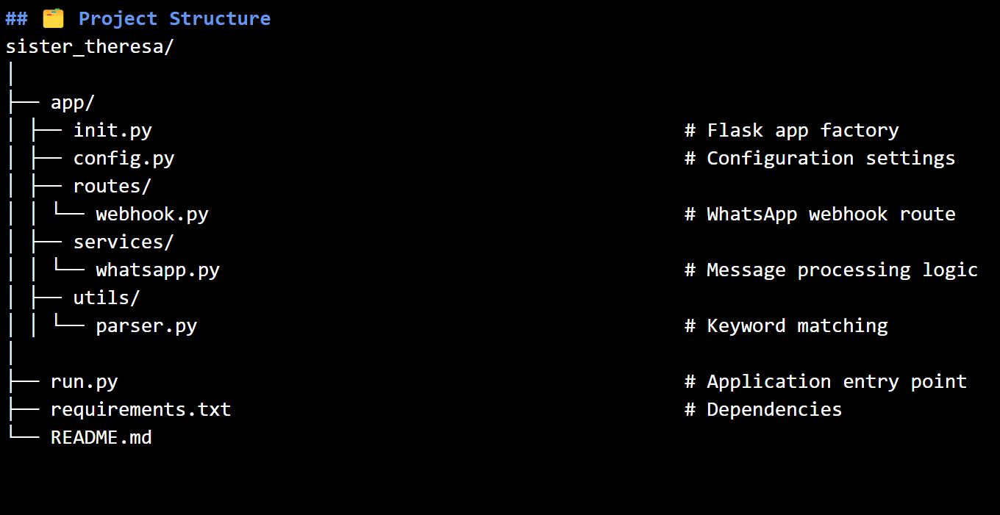

# SISTER THERESA

This is a scalable Flask-based backend for a WhatsApp chatbot using the [WhatsApp Business Cloud API](https://developers.facebook.com/docs/whatsapp/cloud-api). It handles incoming messages via webhook, processes user input, and sends automated replies.

---

## 🚀 Features

- Flask application structured in package form for scalability
- WhatsApp webhook verification and message handling
- Modular service and routing logic
- Keyword-based auto-responses (extendable to NLP or AI)
- Clean, professional codebase with room for growth

---

## 🗂️ Project Structure


---

## 🔧 Installation

### 1. Clone the Repository

```bash
git clone https://github.com/yourusername/sister_theresa.git
cd sister_theresa

```

### 2. Create and Activate Virtual Environment

```bash
python -m venv venv
source venv/bin/activate  # On Windows: venv\Scripts\activate
```
### 3. Install Dependencies

```bash
pip install -r requirements.txt

```

### ⚙️ Configuration
Create a .env file or set the following environment variables in your shell:
```
WHATSAPP_ACCESS_TOKEN=your_meta_access_token
WHATSAPP_PHONE_NUMBER_ID=your_phone_number_id
WHATSAPP_VERIFY_TOKEN=your_webhook_verify_token
```
Alternatively, update app/config.py with your credentials.

### ▶️ Run the Server

```bash
python run.py
```

### 🌐 Expose Webhook for WhatsApp (using Ngrok)
Install Ngrok and run:

```bash
ngrok http 5000
```

Copy the public URL (e.g., https://abcd.ngrok.io) and set your webhook in the Meta developer dashboard:

```arduino
https://abcd.ngrok.io/webhook
```

### 💬 How It Works
- Incoming messages from WhatsApp trigger the /webhook endpoint

- Messages are parsed and matched with keywords

- Bot sends back predefined replies using the WhatsApp Cloud API

### 📌 Sample Keywords (in parser.py)

| Keyword | Bot Response                                                                 |
| ------- | ---------------------------------------------------------------------------- |
| service | "We offer chatbot development, automation, and more."                        |
| support | "You can reach support at [support@example.com](mailto:support@example.com)" |
| office  | "We're located in Ibadan, Nigeria."                                          |


### 📦 Deployment

This app can be deployed on:

- Render

- Fly.io

- Railway

- Any Linux server with Python 3.9+

### 📄 License
This project is open-source and MIT licensed. Modify and use freely for your own projects or client work.

### ✉️ Contact
Developed by Samuel Nnadozie (Zinando Concepts)
Need help? Contact: [zinando](mailto:xienando4reaconcepts@gmail.com)